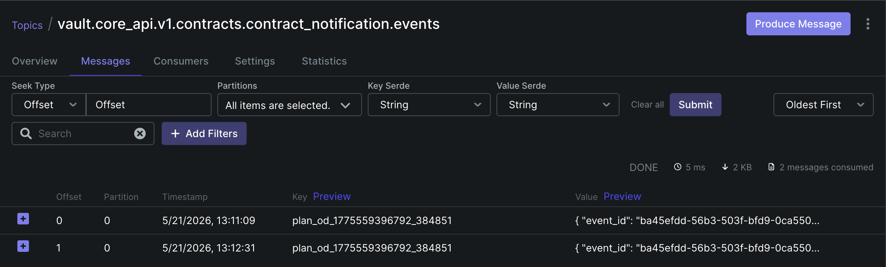
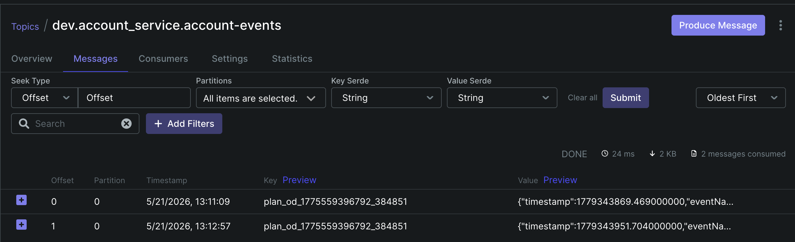
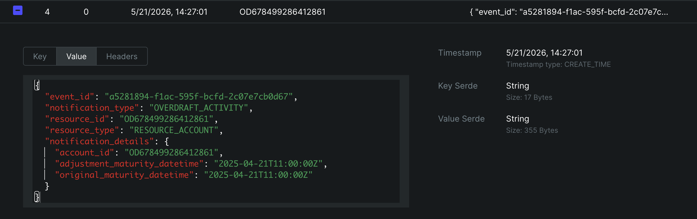
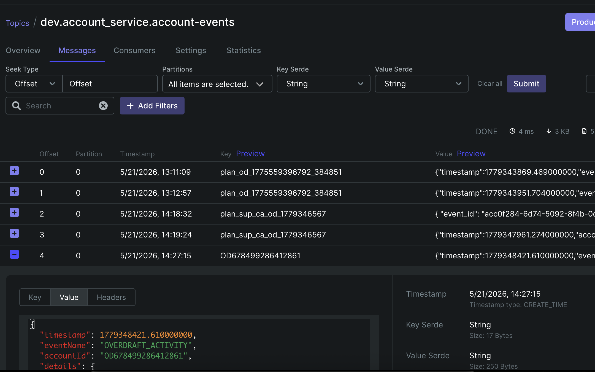
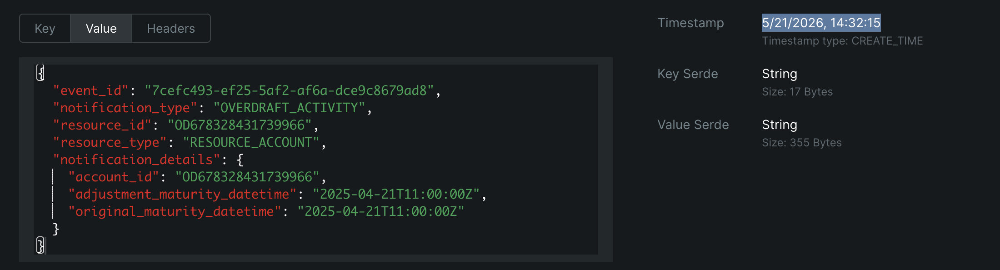
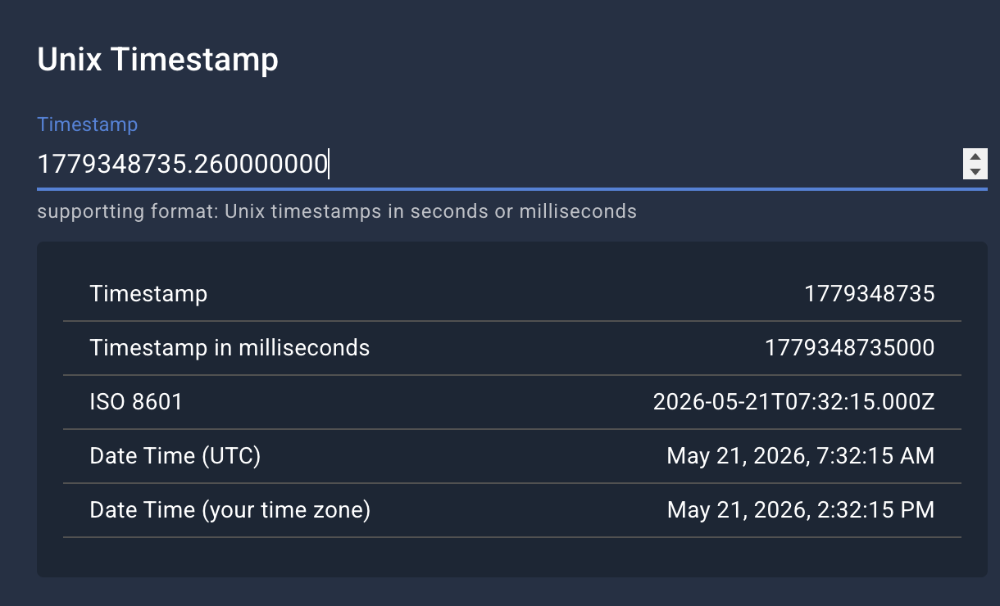

Test cases:

# 1. Consume and produce to internal successfully => PASS

Consume from vault.core_api.v1.contracts.contract_notification.events



Produce to internal kafka topic: dev.account_service.account-events



Message details:

```
{
    "timestamp": 1779343869.469000000,
    "eventName": "DAYS_PAST_DUE",
    "accountId": "plan_od_1775559396792_384851",
    "details": {
        "account_id": "OD1271915726135698",
        "actual_normal_days_past_due": "36",
        "effective_datetime": "2026-05-20T11:00:00Z",
        "interest_overdue": "[{\"interest_overdue\": \"7430\", \"late_payment_charge_on_overdue_interest\": \"73\", \"since\": \"2026-04-15T11:00:00Z\"}, {\"interest_overdue\": \"74301\", \"late_payment_charge_on_overdue_interest\": \"0\", \"since\": \"2026-05-15T11:00:00Z\"}]",
        "normal_days_past_due": "36",
        "outstanding": "81804",
        "principal": "6026661",
        "product_type": "overdraft",
        "remaining_principal": "13973339",
        "scheme_code": "Truong",
        "since": "2026-04-15T11:00:00Z"
    }
}
```

# 2. Wrong json format => PASS

Expected result:

    - Log error
    - Ignore and continue consume next message

Log result:

```
2026-05-21 07:02:58.075 account-service [][] []  INFO [n-group-local-3] .f.a.e.c.AccountEventNotificationHandler : Receive notification event from TM: topic=vault.core_api.v1.contracts.contract_notification.events key=**********************567 offset=2 time=1779346978061
2026-05-21 07:02:58.075 account-service [164cda56b4771ab97d87e91cee475b68][c071286571b95a4f] []  WARN [t-group-local-6] c.f.a.e.c.BlockadeMigrationEventHandler  : Receive blockade notification event from TM: topic=vault.core_api.v1.contracts.contract_notification.events, key=**********************567 offset=2 time=1779346978061
2026-05-21 07:02:58.079 account-service [164cda56b4771ab97d87e91cee475b68][c071286571b95a4f] [] ERROR [t-group-local-6] c.f.a.e.c.BlockadeMigrationEventHandler  : Something wrong, continue with others message

com.finx.account.event.consumer.exception.ParsingTMEventException: Unexpected end-of-input: expected close marker for Object (start marker at [Source: REDACTED (`StreamReadFeature.INCLUDE_SOURCE_IN_LOCATION` disabled); line: 1, column: 1])
 at [Source: REDACTED (`StreamReadFeature.INCLUDE_SOURCE_IN_LOCATION` disabled); line: 13, column: 1]
    at com.finx.account.event.consumer.BlockadeMigrationEventHandler.parse(BlockadeMigrationEventHandler.java:78)
```

# 3. Missing fields => PASS

Expected result:

    - Still parse success
    - Sent message with received information

Input: empty notification_type

```
{
	"event_id": "acc0f284-6d74-5092-8f4b-0c80401d09f1",
	"resource_id": "plan_sup_ca_od_1779346567",
	"resource_type": "RESOURCE_PLAN",
	"notification_details": {
		"client_batch_id": "ff16025f-b224-494e-afae-9f155b61dbef",
		"current_account_id": "752422646",
		"overdraft_account_id": "OD678328431739966",
		"overdraft_amount": "7777777",
		"posting_instruction_batch_id": "8a27c99a-60e2-413a-81b8-ce979e758694"
	}
}
```

Received: no event name in the payload

```
{
	"timestamp": 1779347961.274000000,
	"accountId": "plan_sup_ca_od_1779346567",
	"details": {
		"client_batch_id": "ff16025f-b224-494e-afae-9f155b61dbef",
		"current_account_id": "752422646",
		"overdraft_account_id": "OD678328431739966",
		"overdraft_amount": "7777777",
		"posting_instruction_batch_id": "8a27c99a-60e2-413a-81b8-ce979e758694"
	}
}
```

# 4. Server died while consuming => PASS

Leave the consumer to sleep for 10 seconds, meanwhile shutdown the app. Then start it again

Expected result:

    - Message can be reconsumed
    - No lost message

Input:



Received:




# 5. BlockadeMigrationEventHandler can consume message independently

Expected result:

    - Both consumers can consume from the same topic vault.core_api.v1.contracts.contract_notification.events

We can check that in the log

```
2026-05-21 07:32:15.333 account-service [][] []  INFO [n-group-local-3] .f.a.e.c.AccountEventNotificationHandler : Receive notification event from TM: topic=vault.core_api.v1.contracts.contract_notification.events key=**************966 offset=5 time=1779348735260
2026-05-21 07:32:15.333 account-service [d596c3e91da98f7a57f3431b5ab9340b][1a020135aabc4298] []  WARN [t-group-local-6] c.f.a.e.c.BlockadeMigrationEventHandler  : Receive blockade notification event from TM: topic=vault.core_api.v1.contracts.contract_notification.events, key=**************966 offset=5 time=1779348735260
2
```

# 6. Verify timestamp mapping

Check between timestamp of the kafka and converted timestamp in the payload

Time: 5/21/2026, 14:32:15



Time message converted in payload

ZonedDateTime: 1779348735.260000000

