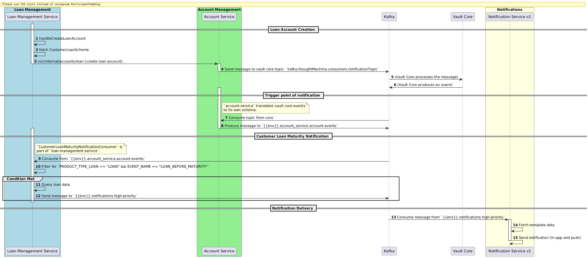

1. loan-management-service

handleCreateLoanAccount

fetch CustomerLoanScheme

create loan account (account-service)

2. account-service

/v1/internal/accounts/loan

Send kafka message to vault core topics: kafka.thoughtMachine.consumers.notificationTopic

Consume topic from core and produce message topic + message mapping: {{env}}.account_service.account-events

3. loan-management-service

Consume from topic {{env}}.account_service.account-events

CustomerLoanMaturityNotificationConsumer

Filter for PRODUCT_TYPE_LOAN == "LOAN" && EVENT_NAME == "LOAN_BEFORE_MATURITY"

Query loan data

Send message to {{env}}.notifications.high-priority

4. notification-service-v2

Consume message from {{env}}.notifications.high-priority

Fetch template data and send notification (in-app and push)

Sequence diagram

